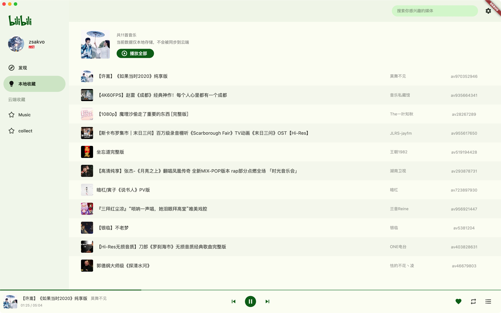
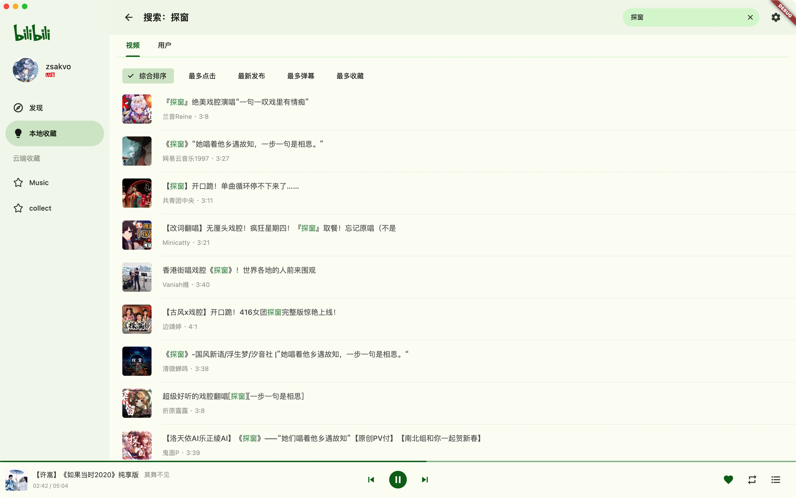
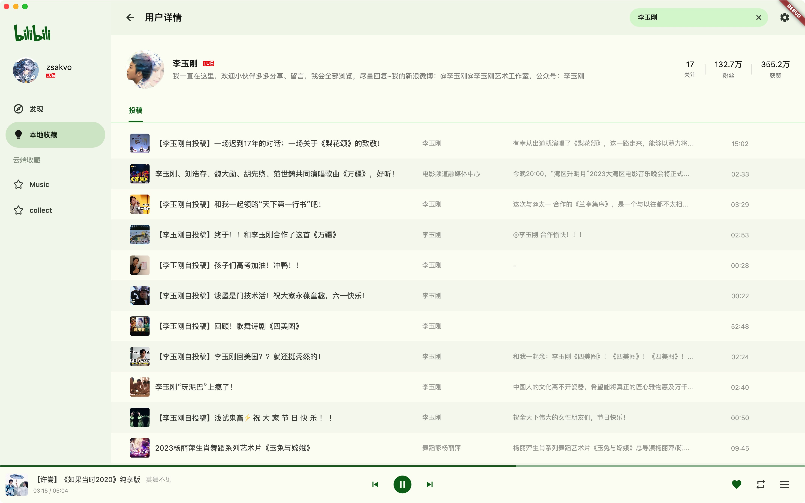
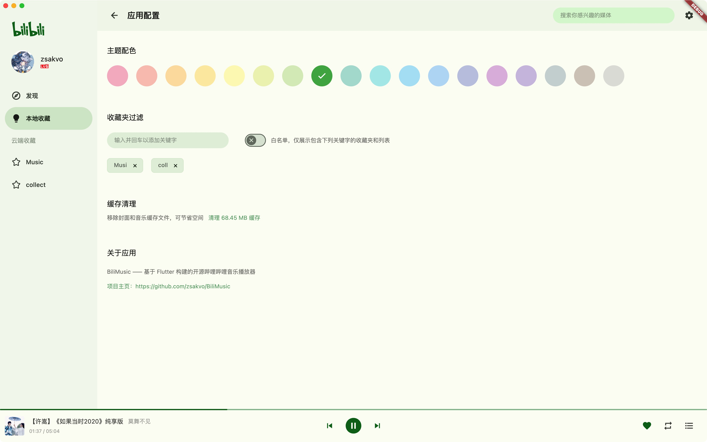
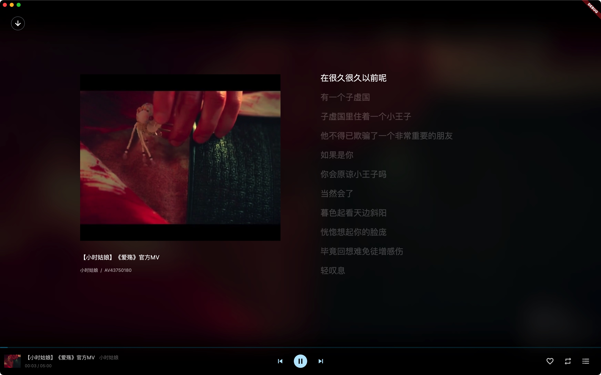

# BiliMusic

 

  

一个基于 Flutter 实现，使用哔哩哔哩作为音频源的音乐播放器（哔哩哔哩，但是只有声音！）

## 平台

| Linux | macOS | Windows | iOS | Android |
| :---: | :---: | :-----: | :-: | :-----: |
|   -   |  ✔️   |   ✔️    |  -  |    -    |

## 功能

- [x] 有限的探索功能（展示音乐区部分首页数据）
- [x] 媒体搜索
- [x] 用户搜索
- [x] 用户详情
- [x] 个人收藏夹
- [x] 收藏的播放列表
- [x] 音乐播放
- [x] 字幕展示（目前仅自动获取 AI 字幕，需要登录）
- [x] 用户登陆
- [x] 主题配色

## 截图

 

## 问题

- 诸如字幕等部分功能需要登录账户方可使用
- 「本地收藏」内的数据不会同步到云端，仅做本地存储。
- macOS 下，由于 webview 组件问题，登录成功后可能无法正常释放对应内存，建议手动关闭重开应用
- Linux 目前仅测试于 Ubuntu22.04，且存在 MPV 播放问题待解决
- Android/iOS 短期内无兼容计划（UI 改动较大）
- 待追加……

## 路线

待整理。

## 声明

- 项目涉及的 API 均收集自官方，不包含任何破解内容。
- 本项目仅供学习和交流，请勿用作额外用途。

## 感谢

- [bilibili-API-collect](https://github.com/SocialSisterYi/bilibili-API-collect): 哔哩哔哩第三方 API 收集参考
- [bili_you](https://github.com/lucinhu/bili_you): 第三方哔哩哔哩客户端
- [just_audio](https://github.com/ryanheise/just_audio): 播放器核心组件
